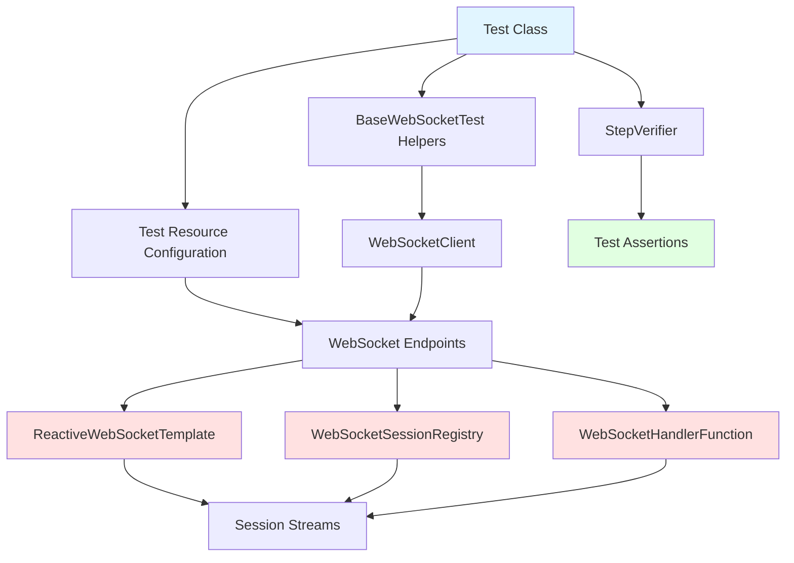
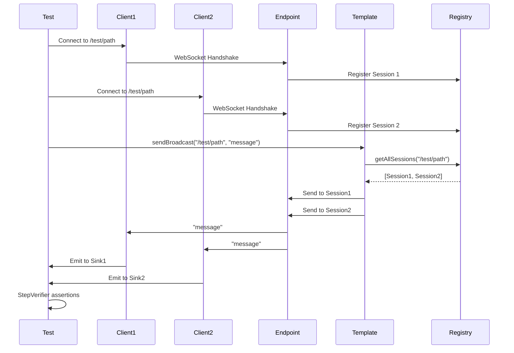

# Implementation Plan: RWS-52 - Add Missing Tests

**Issue:** [RWS-52](https://elpisdev.youtrack.cloud/issue/RWS-52/Chore-Add-Missing-Tests)  
**Type:** Bug (Chore)  
**Priority:** Normal  
**Status:** In Progress  
**Parent Issue:** [RWS-48](https://elpisdev.youtrack.cloud/issue/RWS-48) - Update/Cleanup After Delay Period  
**Created:** December 26, 2025  
**Target Coverage:** 90%  
**PR Reference:** [#64](https://app.codacy.com/gh/elpis-dev/reactive-websockets/pull-requests/64)

---

## Executive Summary

This issue addresses missing test coverage for three critical components in the reactive-websockets-starter module:
1. **ReactiveWebSocketTemplate** (Current: 7.14% → Target: 90%)
2. **WebSocketHandlerFunction** (Current: 100% → Needs additional functional tests)
3. **WebSocketSessionRegistry** (Current: 40.43% → Target: 90%)

The tests must be **functional tests only** (integration tests) placed in the `functional-tests` module to properly test the behavior of these components in a real WebSocket context.

---

## Current Coverage Analysis

### From Codacy PR #64

| Component | Current Coverage | Covered Lines | Coverable Lines | Gap |
|-----------|-----------------|---------------|-----------------|-----|
| **ReactiveWebSocketTemplate** | **7.14%** | 4 / 56 | 52 lines | **Critical** |
| **WebSocketSessionRegistry** | **40.43%** | 18 / 45 | 27 lines | **High** |
| WebSocketHandlerFunction | 100% | 2 / 2 | 0 lines | Low |
| WebSocketHandlerFunctions | 89.66% | 26 / 29 | 3 lines | Low |
| BaseWebSocketHandler | 30.65% | 19 / 62 | 43 lines | High |
| AdaptiveWebSocketHandler | 83.81% | 88 / 105 | 17 lines | Medium |
| PathSessions | 76% | 19 / 25 | 6 lines | Medium |

### Priority Focus Areas

1. **ReactiveWebSocketTemplate** - 52 uncovered lines (CRITICAL)
2. **WebSocketSessionRegistry** - 27 uncovered lines (HIGH)
3. **WebSocketHandlerFunction** - Needs functional tests for all parameter types (MEDIUM)

---

## Goals and Objectives

### Primary Goals
- Achieve **90% test coverage** for ReactiveWebSocketTemplate
- Achieve **90% test coverage** for WebSocketSessionRegistry
- Add comprehensive functional tests for WebSocketHandlerFunction covering all request parameter types (query, path, headers, body)
- Add functional tests for exception handling in WebSocketHandlerFunction

### Secondary Goals
- Improve overall test coverage of the starter module
- Document testing patterns for future contributors
- Ensure tests are maintainable and readable

### Success Metrics
- All three components reach 90%+ coverage
- All tests pass consistently
- Tests follow AAA pattern (Arrange-Act-Assert)
- Tests run in under 30 seconds total
- Zero flaky tests

---

## Requirements

### Functional Requirements

#### 1. ReactiveWebSocketTemplate Tests
Must test all public methods with multiple scenarios:

**Broadcasting Methods:**
- `sendBroadcast(String path, Object payload)` - single message to all sessions
- `sendBroadcast(String path, Publisher<?> messages)` - stream of messages to all sessions

**Single Session Methods:**
- `sendToSession(String path, String sessionId, Object payload)` - single message to one session
- `sendToSession(String path, String sessionId, Publisher<?> messages)` - stream to one session

**Multiple Sessions Methods:**
- `sendToSessions(String path, Set<String> sessionIds, Object payload)` - message to selected sessions

**Error Handling Methods:**
- `sendError(String path, String sessionId, Object errorPayload)` - error to one session
- `broadcastError(String path, Object errorPayload)` - error to all sessions

**Edge Cases:**
- Session not found scenarios
- Empty session set
- Non-existent path
- Null payloads
- Concurrent access

#### 2. WebSocketSessionRegistry Tests
Must test all public methods:

**Registration/Unregistration:**
- `registerSession(String path, String sessionId, SessionStreams streams)`
- `unregisterSession(String path, String sessionId)`
- Concurrent registration/unregistration

**Session Retrieval:**
- `getSession(String path, String sessionId)`
- `getAllSessions(String path)`
- `getAllPaths()`

**Session Counting:**
- `getTotalSessionCount()`
- `getSessionCount(String path)`

**Maintenance:**
- `cleanupOrphanedSessions()`
- `shutdown()`

**Edge Cases:**
- Multiple paths with sessions
- Path cleanup when empty
- Orphaned session detection
- Concurrent modifications

#### 3. WebSocketHandlerFunction Tests
Must test all request parameter extraction types:

**Query Parameters:**
- Required query parameters
- Optional query parameters
- Default value query parameters
- Multiple query parameters
- All supported types (String, numeric types, etc.)

**Path Variables:**
- Required path variables
- Multiple path variables
- All supported types

**Request Headers:**
- Required headers
- Optional headers
- Default value headers
- Multiple headers
- All supported types

**Request Body:**
- JSON body parsing
- Plain text body
- Empty body scenarios

**Exception Handling:**
- Missing required parameters
- Invalid parameter types
- Malformed JSON
- Custom exception handlers

### Non-Functional Requirements

**Performance:**
- Each test should complete in < 5 seconds
- Test suite should complete in < 30 seconds
- No thread leaks or resource leaks

**Reliability:**
- Zero flaky tests
- Deterministic results
- Proper cleanup in finally/doFinally blocks

**Maintainability:**
- Clear test names following pattern: `testMethodName_Scenario_ExpectedBehavior`
- AAA pattern strictly followed
- Reusable test helpers in BaseWebSocketTest
- Comprehensive comments for complex scenarios

**Code Quality:**
- Follow Google Java Format
- Javadoc for complex test setups
- No code duplication
- Use AssertJ for assertions
- Use StepVerifier for reactive assertions

---

## Technical Approach

### Architecture

#### Test Structure
```
functional-tests/
└── src/test/java/io/github/elpis/reactive/websockets/
    └── impl/
        ├── template/
        │   ├── ReactiveWebSocketTemplateTest.java
        │   └── ReactiveWebSocketTemplateResource.java (test resource)
        ├── session/
        │   ├── WebSocketSessionRegistryTest.java
        │   └── SessionRegistryResource.java (test resource)
        └── handler/
            ├── HandlerFunctionQueryParamTest.java
            ├── HandlerFunctionPathVariableTest.java
            ├── HandlerFunctionHeaderTest.java
            ├── HandlerFunctionBodyTest.java
            ├── HandlerFunctionExceptionTest.java
            └── HandlerFunctionResource.java (test resources)
```

#### Test Resources Pattern
Each test class requires WebSocket endpoint resources:
```java
@Configuration
public class ReactiveWebSocketTemplateResource {
    @Bean
    public WebSocketHandlerFunction templateTestHandlers(
        ReactiveWebSocketTemplate template) {
        return route()
            .handle("/template/test/receiver", (request, sink) -> {
                // Test endpoint that receives messages
            });
    }
}
```

### Technology Stack

**Testing Frameworks:**
- JUnit 5 (Jupiter)
- Spring Boot Test (`@SpringBootTest`)
- Reactor Test (StepVerifier)
- AssertJ (fluent assertions)

**WebSocket Testing:**
- Spring WebFlux WebSocketClient
- Reactor Sinks for async communication
- Custom BaseWebSocketTest helpers

**Utilities:**
- LogCaptor (for log verification)
- OutputCaptureExtension (for console output verification)

### Design Decisions

#### Decision 1: Multiple WebSocket Sessions in Single Test
**Rationale:** To properly test ReactiveWebSocketTemplate broadcasting and multi-session methods, we need to create and manage multiple WebSocket client connections within a single test.

**Implementation:**
```java
@Test
void testBroadcast_MultipleClients_AllReceiveMessage() {
    // Create 3 clients
    Sinks.One<String> sink1 = Sinks.one();
    Sinks.One<String> sink2 = Sinks.one();
    Sinks.One<String> sink3 = Sinks.one();
    
    // Connect all clients
    // Use template to broadcast
    // Verify all receive the message
}
```

#### Decision 2: Separate Test Classes per Concern
**Rationale:** Instead of one massive test class, separate by component and concern for better organization and maintenance.

**Benefits:**
- Easier to run specific test subsets
- Better test isolation
- Clearer test organization
- Follows Single Responsibility Principle

#### Decision 3: Test Error Scenarios Explicitly
**Rationale:** Error handling is critical for WebSocket applications. Each error scenario needs explicit testing.

**Coverage:**
- SessionNotFoundException scenarios
- Invalid session IDs
- Null parameters
- Network errors
- Sink emission failures

#### Decision 4: Use Test Resources (Endpoints) Not Mocks
**Rationale:** These are functional tests - we test real WebSocket behavior, not mocked components.

**Approach:**
- Create test WebSocket endpoints in `@Configuration` classes
- Use real ReactiveWebSocketTemplate instances
- Test actual message flow
- Verify real session registry behavior

---

## Implementation Plan

### Phase 1: Setup and Infrastructure (2 hours)

#### Task 1.1: Create Test Package Structure
**Duration:** 30 minutes  
**Files:**
- Create `functional-tests/src/test/java/io/github/elpis/reactive/websockets/impl/template/`
- Create `functional-tests/src/test/java/io/github/elpis/reactive/websockets/impl/session/`
- Create `functional-tests/src/test/java/io/github/elpis/reactive/websockets/impl/handler/`

**Acceptance Criteria:**
- [ ] All directories created
- [ ] Package structure follows existing conventions

#### Task 1.2: Create Base Test Helpers
**Duration:** 1 hour  
**Files:**
- Update `BaseWebSocketTest.java` with multi-client support

**New Methods:**
```java
// Support for multiple concurrent clients
public List<Mono<Void>> withMultipleClients(
    String path, 
    int clientCount,
    Function<WebSocketSession, Mono<Void>> handler);

// Support for getting session IDs
public String getSessionId(WebSocketSession session);

// Support for waiting for N clients to connect
public Mono<Void> waitForConnections(int count, Duration timeout);
```

**Acceptance Criteria:**
- [ ] Multi-client helper methods added
- [ ] Session ID retrieval helper added
- [ ] All existing tests still pass

#### Task 1.3: Create Test Resource Base Classes
**Duration:** 30 minutes  
**Files:**
- Create base patterns for test resources

**Acceptance Criteria:**
- [ ] Reusable resource patterns documented
- [ ] Example resource configuration created

---

### Phase 2: ReactiveWebSocketTemplate Tests (6 hours)

#### Task 2.1: Create Test Resource Endpoints
**Duration:** 1 hour  
**File:** `ReactiveWebSocketTemplateResource.java`

**Endpoints:**
- `/template/broadcast/receiver` - Simple receiver for broadcast tests
- `/template/session/receiver` - Receiver that echoes session ID
- `/template/error/receiver` - Receiver for error scenario tests

**Acceptance Criteria:**
- [ ] All resource endpoints created
- [ ] Endpoints properly annotated
- [ ] Resource can be imported in tests

#### Task 2.2: Test Broadcasting Methods
**Duration:** 2 hours  
**File:** `ReactiveWebSocketTemplateTest.java`

**Tests:**
```java
@Test
void testSendBroadcast_SinglePayload_AllSessionsReceive()

@Test
void testSendBroadcast_PublisherPayload_AllSessionsReceiveAllMessages()

@Test
void testSendBroadcast_EmptyPath_NoSessionsAffected()

@Test
void testSendBroadcast_NoSessions_CompletesSuccessfully()
```

**Coverage Target:** Lines 72-91 (broadcast methods)

**Acceptance Criteria:**
- [ ] All broadcast scenarios tested
- [ ] Multiple clients (3+) used in tests
- [ ] StepVerifier used for verification
- [ ] All tests pass consistently

#### Task 2.3: Test Single Session Methods
**Duration:** 1.5 hours  
**File:** `ReactiveWebSocketTemplateTest.java`

**Tests:**
```java
@Test
void testSendToSession_ValidSession_MessageReceived()

@Test
void testSendToSession_InvalidSessionId_ThrowsSessionNotFoundException()

@Test
void testSendToSession_PublisherPayload_AllMessagesReceived()

@Test
void testSendToSession_NullPayload_HandledGracefully()
```

**Coverage Target:** Lines 99-137 (sendToSession methods)

**Acceptance Criteria:**
- [ ] Valid session scenarios tested
- [ ] SessionNotFoundException tested
- [ ] Publisher overload tested
- [ ] All tests pass

#### Task 2.4: Test Multiple Sessions Methods
**Duration:** 1 hour  
**File:** `ReactiveWebSocketTemplateTest.java`

**Tests:**
```java
@Test
void testSendToSessions_ValidSessionIds_OnlyTargetedReceive()

@Test
void testSendToSessions_MixedValidInvalid_ValidOnesReceive()

@Test
void testSendToSessions_EmptySet_CompletesSuccessfully()

@Test
void testSendToSessions_AllInvalid_CompletesWithoutError()
```

**Coverage Target:** Lines 149-160 (sendToSessions method)

**Acceptance Criteria:**
- [ ] Selective sending tested
- [ ] Error handling tested
- [ ] Edge cases covered
- [ ] All tests pass

#### Task 2.5: Test Error Methods
**Duration:** 30 minutes  
**File:** `ReactiveWebSocketTemplateTest.java`

**Tests:**
```java
@Test
void testSendError_ValidSession_ErrorReceived()

@Test
void testSendError_InvalidSession_ThrowsSessionNotFoundException()

@Test
void testBroadcastError_AllSessionsReceiveError()

@Test
void testBroadcastError_NoSessions_CompletesSuccessfully()
```

**Coverage Target:** Lines 174-214 (error methods)

**Acceptance Criteria:**
- [ ] Error sending tested
- [ ] Error broadcasting tested
- [ ] SessionNotFoundException scenarios tested
- [ ] All tests pass

---

### Phase 3: WebSocketSessionRegistry Tests (4 hours)

#### Task 3.1: Create Test Resource and Setup
**Duration:** 1 hour  
**File:** `SessionRegistryResource.java`

**Endpoints:**
- `/registry/test/session` - Basic endpoint for session testing
- `/registry/test/multi` - Multi-session endpoint

**Acceptance Criteria:**
- [ ] Test resources created
- [ ] Can inject WebSocketSessionRegistry
- [ ] Can access session metadata

#### Task 3.2: Test Registration and Retrieval
**Duration:** 1.5 hours  
**File:** `WebSocketSessionRegistryTest.java`

**Tests:**
```java
@Test
void testRegisterSession_ValidSession_RegisteredSuccessfully()

@Test
void testUnregisterSession_ExistingSession_RemovedSuccessfully()

@Test
void testGetSession_ExistingSession_ReturnsSession()

@Test
void testGetSession_NonExistingSession_ReturnsEmpty()

@Test
void testGetAllSessions_ValidPath_ReturnsAllSessions()

@Test
void testGetAllSessions_NonExistingPath_ReturnsEmptyCollection()

@Test
void testGetAllPaths_MultiplePaths_ReturnsAllPaths()
```

**Coverage Target:** Lines 40-82 (registration/retrieval methods)

**Acceptance Criteria:**
- [ ] All CRUD operations tested
- [ ] Edge cases covered
- [ ] Optional handling tested
- [ ] All tests pass

#### Task 3.3: Test Session Counting
**Duration:** 30 minutes  
**File:** `WebSocketSessionRegistryTest.java`

**Tests:**
```java
@Test
void testGetTotalSessionCount_MultiplePathsAndSessions_ReturnsCorrectTotal()

@Test
void testGetSessionCount_SpecificPath_ReturnsCorrectCount()

@Test
void testGetSessionCount_EmptyPath_ReturnsZero()

@Test
void testSessionCount_AfterUnregister_DecreasesCorrectly()
```

**Coverage Target:** Lines 92-106 (counting methods)

**Acceptance Criteria:**
- [ ] Count accuracy tested
- [ ] Multi-path scenarios tested
- [ ] Count updates after unregister tested
- [ ] All tests pass

#### Task 3.4: Test Maintenance Methods
**Duration:** 1 hour  
**File:** `WebSocketSessionRegistryTest.java`

**Tests:**
```java
@Test
void testCleanupOrphanedSessions_ClosedSession_RemovedAutomatically()

@Test
void testCleanupOrphanedSessions_AllHealthy_NoChanges()

@Test
void testShutdown_ActiveSessions_AllCleaned()

@Test
void testShutdown_EmptyRegistry_CompletesSuccessfully()
```

**Coverage Target:** Lines 123-156 (cleanup and shutdown methods)

**Acceptance Criteria:**
- [ ] Orphaned session cleanup tested
- [ ] Shutdown process tested
- [ ] Log messages verified
- [ ] All tests pass

---

### Phase 4: WebSocketHandlerFunction Tests (5 hours)

#### Task 4.1: Create Test Resources for All Parameter Types
**Duration:** 1.5 hours  
**File:** `HandlerFunctionResource.java`

**Endpoints covering:**
- Query parameters (all types, required/optional/default)
- Path variables (all types)
- Headers (all types, required/optional/default)
- Request body (JSON, plain text)
- Multiple parameters combined
- Exception scenarios

**Acceptance Criteria:**
- [ ] All parameter type combinations covered
- [ ] Exception scenarios included
- [ ] Resources well-organized

#### Task 4.2: Test Query Parameter Extraction (EXPANDED)
**Duration:** 1 hour  
**File:** `HandlerFunctionQueryParamTest.java`

**Tests:** (Expand existing QueryParameterSocketTest)
```java
@Test
void testQueryParam_AllTypes_ExtractedCorrectly()

@Test
void testQueryParam_Optional_HandledCorrectly()

@Test
void testQueryParam_DefaultValue_UsedWhenMissing()

@Test
void testQueryParam_Multiple_AllExtracted()

@Test
void testQueryParam_Missing_ThrowsException()

@Test
void testQueryParam_InvalidType_ThrowsException()
```

**Coverage Goal:** Complete coverage of query parameter handling in WebSocketHandlerFunction

**Acceptance Criteria:**
- [ ] All type scenarios tested
- [ ] Optional handling tested
- [ ] Exception cases tested
- [ ] All tests pass

#### Task 4.3: Test Path Variable Extraction (EXPANDED)
**Duration:** 45 minutes  
**File:** `HandlerFunctionPathVariableTest.java`

**Tests:** (Expand existing PathVariableSocketTest)
```java
@Test
void testPathVariable_AllTypes_ExtractedCorrectly()

@Test
void testPathVariable_Multiple_AllExtracted()

@Test
void testPathVariable_Pattern_MatchedCorrectly()

@Test
void testPathVariable_InvalidType_ThrowsException()
```

**Acceptance Criteria:**
- [ ] All type scenarios tested
- [ ] Multiple path variables tested
- [ ] Exception cases tested
- [ ] All tests pass

#### Task 4.4: Test Header Extraction (EXPANDED)
**Duration:** 1 hour  
**File:** `HandlerFunctionHeaderTest.java`

**Tests:** (Expand existing HeaderSocketTest)
```java
@Test
void testHeader_AllTypes_ExtractedCorrectly()

@Test
void testHeader_Optional_HandledCorrectly()

@Test
void testHeader_DefaultValue_UsedWhenMissing()

@Test
void testHeader_Multiple_AllExtracted()

@Test
void testHeader_Missing_ThrowsException()

@Test
void testHeader_CaseInsensitive_HandledCorrectly()
```

**Acceptance Criteria:**
- [ ] All type scenarios tested
- [ ] Optional handling tested
- [ ] Case sensitivity tested
- [ ] All tests pass

#### Task 4.5: Test Body Extraction (EXPANDED)
**Duration:** 45 minutes  
**File:** `HandlerFunctionBodyTest.java`

**Tests:** (Expand existing BodySocketTest/JsonBodySocketTest)
```java
@Test
void testBody_JsonObject_ParsedCorrectly()

@Test
void testBody_JsonArray_ParsedCorrectly()

@Test
void testBody_PlainText_ExtractedCorrectly()

@Test
void testBody_Empty_HandledCorrectly()

@Test
void testBody_MalformedJson_ThrowsException()

@Test
void testBody_InvalidType_ThrowsException()
```

**Acceptance Criteria:**
- [ ] JSON parsing tested
- [ ] Plain text tested
- [ ] Error scenarios tested
- [ ] All tests pass

#### Task 4.6: Test Exception Handling
**Duration:** 1 hour  
**File:** `HandlerFunctionExceptionTest.java`

**Tests:**
```java
@Test
void testException_MissingRequiredParam_ReturnsErrorMessage()

@Test
void testException_InvalidType_ReturnsErrorMessage()

@Test
void testException_CustomException_HandledByHandler()

@Test
void testException_RuntimeException_ReturnsGenericError()

@Test
void testException_ConnectionClosed_HandledGracefully()
```

**Acceptance Criteria:**
- [ ] All exception types tested
- [ ] Error messages verified
- [ ] Connection close tested
- [ ] All tests pass

---

### Phase 5: Integration and Verification (2 hours)

#### Task 5.1: Run Full Test Suite
**Duration:** 30 minutes

**Actions:**
```bash
mvn clean test -pl functional-tests
```

**Acceptance Criteria:**
- [ ] All tests pass
- [ ] No flaky tests
- [ ] Total runtime < 30 seconds

#### Task 5.2: Verify Coverage with Codacy
**Duration:** 30 minutes

**Actions:**
1. Commit and push changes
2. Check Codacy coverage report
3. Verify 90% threshold met for all three components

**Acceptance Criteria:**
- [ ] ReactiveWebSocketTemplate ≥ 90%
- [ ] WebSocketSessionRegistry ≥ 90%
- [ ] WebSocketHandlerFunction comprehensive coverage
- [ ] Overall project coverage improved

#### Task 5.3: Code Review and Cleanup
**Duration:** 1 hour

**Actions:**
- Review all test code for quality
- Remove any code duplication
- Ensure all tests follow AAA pattern
- Verify Javadoc completeness
- Check Google Java Format compliance

**Acceptance Criteria:**
- [ ] No code duplication
- [ ] All tests well-documented
- [ ] Consistent naming conventions
- [ ] Google Java Format applied
- [ ] No compiler warnings

---

## Dependencies

### Internal Dependencies
- BaseWebSocketTest class (existing)
- BootStarter test configuration (existing)
- Test security configuration (existing)

### External Dependencies
- Spring Boot Test framework
- Spring WebFlux WebSocketClient
- Project Reactor test utilities
- JUnit 5
- AssertJ

### Blocking Issues
- None identified

---

## Testing Strategy

### Unit Test Coverage
This issue focuses on **functional tests only** - no unit tests required.

### Integration Test Approach

**Test Categories:**
1. **Happy Path Tests** - Normal operation scenarios
2. **Edge Case Tests** - Boundary conditions, empty collections, etc.
3. **Error Tests** - Exception handling, invalid input
4. **Concurrency Tests** - Multiple clients, concurrent operations
5. **Resource Cleanup Tests** - Proper cleanup and shutdown

**Test Patterns:**
```java
@Test
void testMethodName_Scenario_ExpectedBehavior() {
    // Arrange
    String path = "/test/path";
    Sinks.One<String> resultSink = Sinks.one();
    
    // Act
    withClient(path, session -> {
        // Test logic
    }).subscribe();
    
    // Assert
    StepVerifier.create(resultSink.asMono())
        .expectNext("expected value")
        .expectComplete()
        .verify(DEFAULT_GENERIC_TEST_FALLBACK);
}
```

### Test Data Strategy
- Use `BaseWebSocketTest` helper methods for random data
- Use realistic test payloads
- Use meaningful session IDs
- Use descriptive path names

---

## Risks and Mitigation

### Risk 1: Flaky Tests Due to Timing
**Impact:** High  
**Probability:** Medium

**Mitigation:**
- Use `StepVerifier` with appropriate timeouts
- Use `Sinks` for async communication
- Implement proper synchronization
- Use `DEFAULT_GENERIC_TEST_FALLBACK` timeout constant

### Risk 2: Resource Leaks in Tests
**Impact:** High  
**Probability:** Low

**Mitigation:**
- Always use `doFinally()` for cleanup
- Implement proper session cleanup
- Monitor test resource usage
- Use try-with-resources where applicable

### Risk 3: Test Complexity
**Impact:** Medium  
**Probability:** Medium

**Mitigation:**
- Keep tests focused and simple
- Extract complex setup to helper methods
- Use descriptive variable names
- Add comprehensive comments

### Risk 4: Coverage Target Not Met
**Impact:** High  
**Probability:** Low

**Mitigation:**
- Monitor coverage continuously
- Identify uncovered lines early
- Add targeted tests for gaps
- Review Codacy feedback regularly

---

## Timeline

### Week 1: Implementation
- **Day 1 (4 hours):** Phase 1 + Phase 2 (Tasks 2.1-2.2)
- **Day 2 (4 hours):** Phase 2 (Tasks 2.3-2.5)
- **Day 3 (4 hours):** Phase 3 (All tasks)
- **Day 4 (4 hours):** Phase 4 (Tasks 4.1-4.3)
- **Day 5 (3 hours):** Phase 4 (Tasks 4.4-4.6) + Phase 5

### Milestones
- **End of Day 2:** ReactiveWebSocketTemplate tests complete (90% coverage)
- **End of Day 3:** WebSocketSessionRegistry tests complete (90% coverage)
- **End of Day 5:** All tests complete, coverage verified, PR ready

### Total Estimated Effort
**19 hours** (approximately 2.5 working days)

---

## Acceptance Criteria

### Code Quality
- [ ] All tests follow AAA pattern
- [ ] All tests use StepVerifier for reactive assertions
- [ ] All tests use AssertJ for standard assertions
- [ ] No code duplication across tests
- [ ] All public test methods have Javadoc
- [ ] Google Java Format applied to all files
- [ ] No compiler warnings

### Test Coverage
- [ ] ReactiveWebSocketTemplate coverage ≥ 90%
- [ ] WebSocketSessionRegistry coverage ≥ 90%
- [ ] WebSocketHandlerFunction has comprehensive functional tests
- [ ] All public methods tested
- [ ] All error scenarios tested
- [ ] All edge cases tested

### Test Quality
- [ ] All tests pass consistently (10 consecutive runs)
- [ ] No flaky tests
- [ ] Test suite completes in < 30 seconds
- [ ] No resource leaks detected
- [ ] No thread leaks detected

### Documentation
- [ ] All test classes have class-level Javadoc
- [ ] Complex test scenarios explained in comments
- [ ] Test resources documented
- [ ] Helper methods documented

### Integration
- [ ] All tests run in CI/CD pipeline
- [ ] Codacy coverage report shows improvement
- [ ] No regression in existing tests
- [ ] PR approved by reviewers

---

## Deployment Plan

### Pre-Deployment
1. Ensure all tests pass locally
2. Verify coverage targets met
3. Run full test suite multiple times
4. Check for resource leaks

### Deployment Steps
1. Create feature branch: `feature/RWS-52-add-missing-tests`
2. Implement all tests
3. Commit with message: "RWS-52: Add comprehensive functional tests for ReactiveWebSocketTemplate, WebSocketSessionRegistry, and WebSocketHandlerFunction"
4. Push to remote
5. Create pull request
6. Wait for CI/CD validation
7. Request code review
8. Address review feedback
9. Merge to main

### Post-Deployment
1. Monitor Codacy coverage report
2. Verify no regression in existing functionality
3. Update issue status in YouTrack
4. Create summary document

### Rollback Procedure
If tests cause issues:
1. Identify failing tests
2. Temporarily disable failing tests with `@Disabled`
3. Investigate root cause
4. Fix and re-enable
5. If unfixable, revert entire commit

---

## Documentation Requirements

### Test Documentation
Each test class must have:
```java
/**
 * Functional tests for {@link ReactiveWebSocketTemplate}.
 * 
 * <p>These tests verify the template's ability to send messages to WebSocket
 * sessions, including broadcast, targeted, and error scenarios.
 * 
 * <p>Tests use multiple concurrent WebSocket clients to simulate real-world
 * usage patterns.
 * 
 * @author [Your Name]
 * @since 1.0.0
 */
@SpringBootTest(webEnvironment = WebEnvironment.RANDOM_PORT)
@ActiveProfiles({BaseWebSocketTest.DEFAULT_TEST_PROFILE})
@Import({BaseWebSocketTest.PermitAllSecurityConfiguration.class, 
         ReactiveWebSocketTemplateResource.class})
class ReactiveWebSocketTemplateTest extends BaseWebSocketTest {
    // Tests...
}
```

### README Updates
Add section to `functional-tests/README.md`:
```markdown
### Testing ReactiveWebSocketTemplate

Tests for the template are in `impl/template/` and cover:
- Broadcasting to all sessions
- Sending to specific sessions
- Error handling
- Multiple concurrent clients

See `ReactiveWebSocketTemplateTest.java` for examples.
```

### Code Comments
Each complex test should have:
```java
@Test
void testSendBroadcast_MultipleClients_AllReceive() {
    // Arrange: Create 3 WebSocket clients
    // We need multiple clients to verify broadcast behavior
    // Each client has its own Sink to capture received messages
    
    // Act: Use template to broadcast a message
    // The template should send to all registered sessions
    
    // Assert: Verify all 3 clients received the same message
    // Use StepVerifier to check async message delivery
}
```

---

## Open Questions

1. **Q:** Should we test WebSocket message size limits?  
   **A:** Not in this issue - file separate issue if needed

2. **Q:** Should we test SSL/TLS WebSocket connections?  
   **A:** Not in this issue - existing SSL tests cover this

3. **Q:** Should we test with different message formats (binary, text)?  
   **A:** Focus on text messages - binary can be separate issue

4. **Q:** Should we add performance/load tests?  
   **A:** Not in this issue - functional correctness only

---

## References

### Documentation
- [Project Testing Guide](../../.github/instructions/testing.instructions.md)
- [Coding Style Guide](../../.github/instructions/coding-style.instructions.md)
- [Spring WebFlux Testing](https://docs.spring.io/spring-framework/docs/current/reference/html/testing.html#webtestclient)
- [Reactor Testing](https://projectreactor.io/docs/core/release/reference/#testing)

### Related Issues
- [RWS-48](https://elpisdev.youtrack.cloud/issue/RWS-48) - Parent issue
- [PR #64](https://app.codacy.com/gh/elpis-dev/reactive-websockets/pull-requests/64) - Coverage reference

### Code References
- `ReactiveWebSocketTemplate.java` - Lines 56-214 (methods to test)
- `WebSocketSessionRegistry.java` - Lines 26-156 (methods to test)
- `WebSocketHandlerFunction.java` - All parameter extraction logic
- `BaseWebSocketTest.java` - Test infrastructure
- Existing tests in `impl/data/` for patterns

---

## Diagram: Test Architecture



---

## Diagram: Test Execution Flow



---

**Document Version:** 1.0  
**Created:** December 28, 2025  
**Last Updated:** December 28, 2025  
**Author:** GitHub Copilot (elpis-planning mode)  
**Status:** Ready for Implementation

